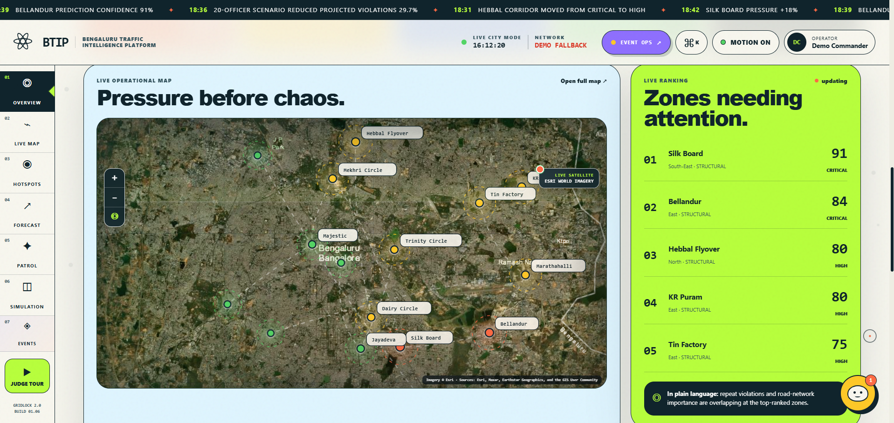
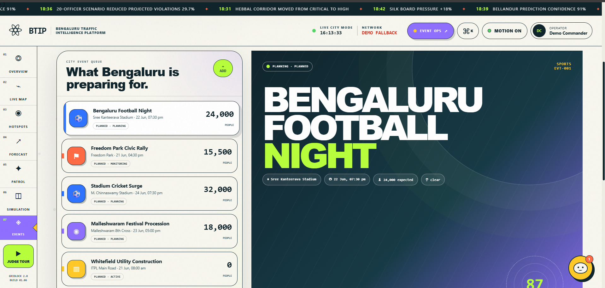
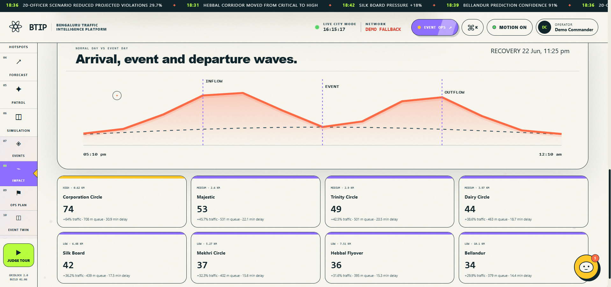
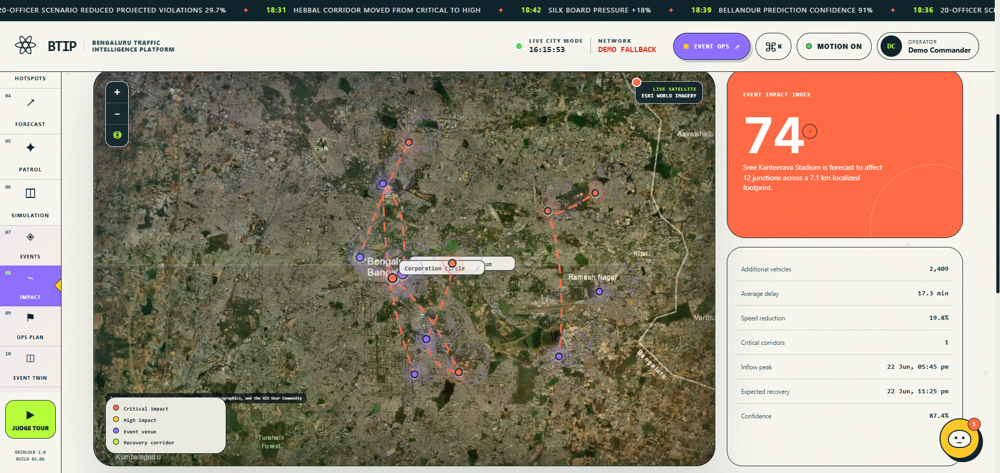
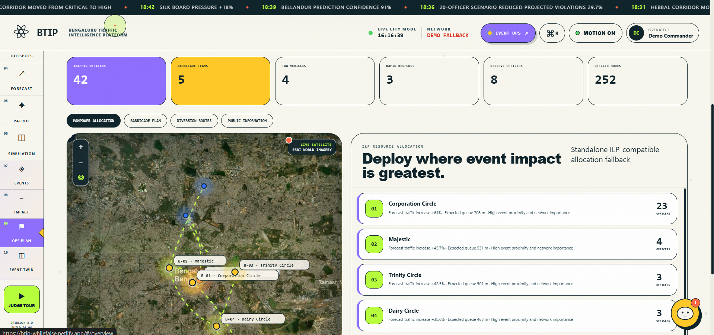
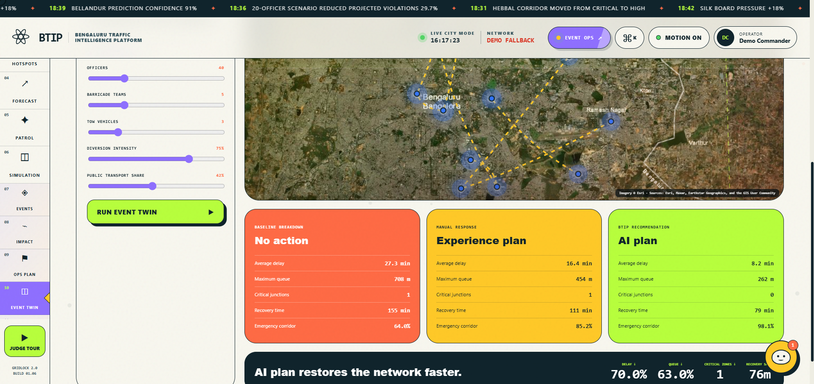
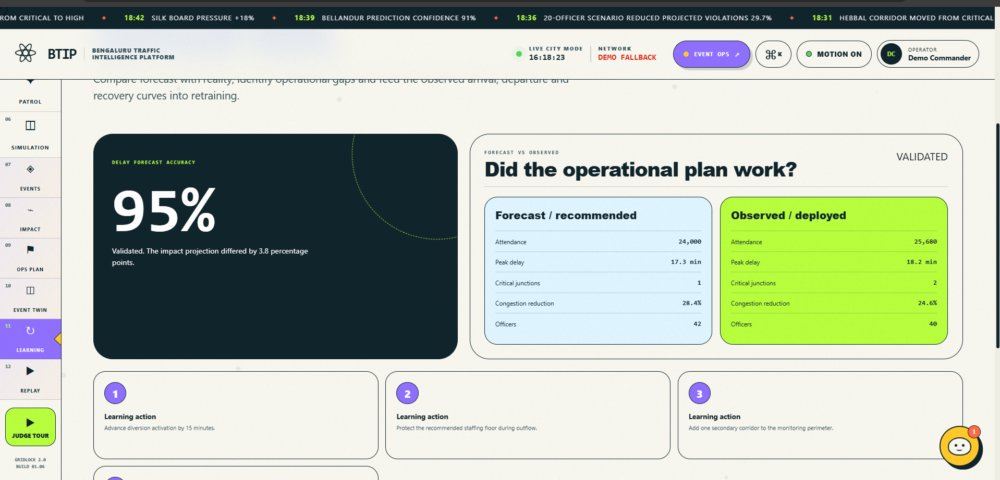
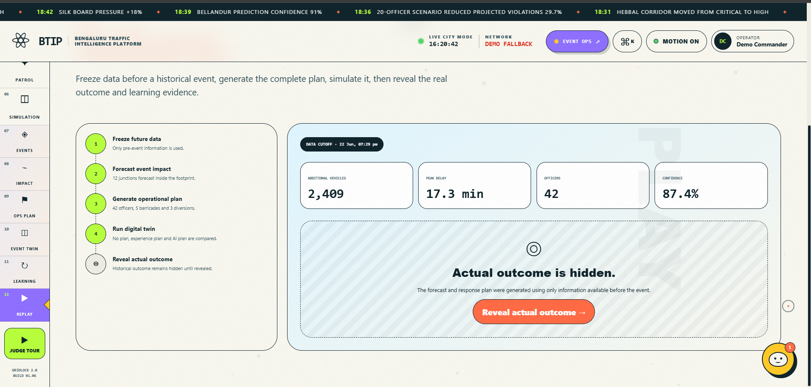
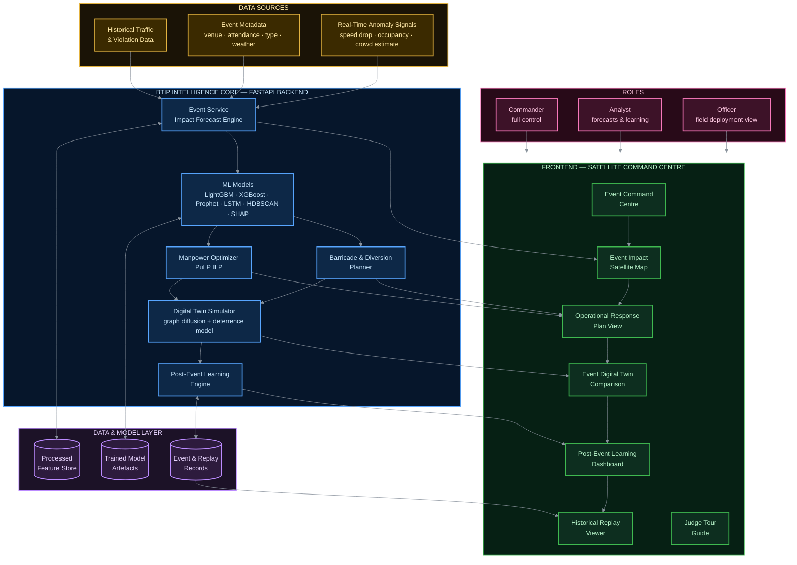

<div align="center">

[](#)
[](#)

<br>

# 🚦 BTIP

<br>

### *Forecast the Jam. Deploy the Plan. Learn From What Happened.*

**An event-driven traffic intelligence platform that connects historical and real-time city data to forecast event congestion, and recommends optimal manpower, barricading, and diversion plans — before the crowd even arrives.**

<br>


[](https://btip-whilefalse.netlify.app/)

<br>

> *"Skip the guesswork. Forecast the impact, deploy the right plan, and let the system learn after every event — powered by ML forecasting, ILP optimization, and digital-twin simulation."*

<br>

 [Quick Start](#-how-to-run-this-project) ·  [Architecture](#%EF%B8%8F-system-architecture) ·  [Capabilities](#-key-capabilities) ·  [API](#-api-endpoints) ·  [Roadmap](#-future-roadmap)

<br>

###   Try It Live — No Setup Needed

**[https://btip-whilefalse.netlify.app/](https://btip-whilefalse.netlify.app/)**


*Scan with your phone, or click the link above, to open the live demo instantly.*

<br>



</div>

---

## 📌 The Problem, In Plain English

Imagine a political rally, a cricket match, a festival, or a sudden road-closure for construction. Within minutes, the roads around it choke up. Today, in most cities — including Bengaluru — here's what actually happens:

-  **Nobody knows in advance** how bad the jam will be.
-  **Police deployment is guesswork**, based on a senior officer's memory of "last time."
-  **Nothing is learned afterward.** The next event starts from zero, all over again.

### The Official Challenge Statement

> *"How can historical and real-time data be used to forecast event-related traffic impact and recommend optimal manpower, barricading, and diversion plans?"*

**BTIP is our answer to exactly this question** — nothing more, nothing less. Every feature in this project traces back to one of these four words: **Forecast → Manpower → Barricading → Diversion**, plus the loop that closes it: **Learning**.

---

## 💡 The Idea, In One Picture

Think of BTIP as a traffic command centre that doesn't just *watch* the city — it *predicts*, *plans*, *tests*, and *remembers*.

```text
     EVENT HAPPENS                SYSTEM THINKS                  POLICE ACT               SYSTEM LEARNS
  (rally / match / festival)    (forecast the damage)         (deploy the plan)         (check what really happened)

        Register/Detect    →    Forecast Impact     →    Generate Response Plan   →    Validate in Digital Twin
                                                                    │
                                                                    ▼
                                                        Manpower + Barricades + Diversions
                                                                    │
                                                                    ▼
                                          Monitor real outcome  →  Post-Event Learning  →  Replay & Verify
```

In short: **BTIP doesn't just show you a traffic jam. It tells you the jam is *about to happen*, tells your officers exactly *where to stand*, and tells you *next time, do this instead.***

---

## 🧭 Table of Contents

1. [Why This Matters](#-the-problem-in-plain-english)
2. [How It Works — Step by Step](#-how-it-works--the-full-journey-of-one-event)
3. [System Architecture](#%EF%B8%8F-system-architecture)
4. [Screens & Visual Tour](#-screens--visual-tour)
5. [Technology Stack](#-technology-stack)
6. [Key Capabilities](#-key-capabilities)
7. [How to Run This Project](#-how-to-run-this-project)
8. [Demo Credentials](#-demo-credentials)
9. [Judge Demo Flow (5-Minute Pitch)](#-recommended-5-minute-judge-walkthrough)
10. [How We Solve the Problem Statement](#-how-btip-maps-to-the-problem-statement)
11. [Dataset](#-dataset)
12. [Future Roadmap](#-future-roadmap)

---

##  How It Works — The Full Journey of One Event

Here's exactly what happens, told as a story, from the moment an event is known about to the moment the system gets smarter for next time.

### Step 1 —  An Event Appears (Planned or Unplanned)

**Planned events** are things we already know about ahead of time: a cricket match, a political rally, a festival, a concert, road construction, a VIP convoy, a protest. We feed in the venue, expected crowd size, start/end time, and parking capacity.

**Unplanned events** are gatherings nobody scheduled — a sudden crowd, an accident, a flash protest. BTIP catches these by noticing *abnormal signals*: traffic suddenly slowing down, more vehicles parked than usual, a spike in control-room calls. Think of it like a smoke detector for traffic — it doesn't need someone to tell it there's a fire.


*The City Event Queue, showing every planned event — like Bengaluru Football Night — ranked by expected crowd size and impact.*


### Step 2 —  Forecasting the Damage Before It Happens

This is the heart of the project. Before the event even starts, BTIP answers:

> *"If we do nothing, how bad will this get?"*

It calculates things like: how many extra vehicles will flood in, how many junctions and roads will be affected, how much extra delay drivers will face, how long queues will get, and how long the area will take to recover afterward — all *before* a single person has arrived at the venue.


*The forecast view: the arrival/event/departure traffic wave alongside every corridor expected to be affected, ranked by impact score.*


### Step 3 —  Seeing It On a Real Map

All of this is shown on an actual satellite map of Bengaluru — the event location, which roads will choke, and which roads will stay clear as recovery routes.


*The Event Impact Index on a live satellite map: the venue, the affected junctions, and the recovery corridors that stay clear.*


### Step 4 —  Turning the Forecast Into an Action Plan

Knowing the problem is only half the job. BTIP converts the forecast straight into a field-ready plan:

| What gets planned | In simple terms |
|---|---|
| **Manpower** | How many officers, where, and from what time |
| **Barricades** | Where to physically block traffic, and why (e.g. "protect the pedestrian gate") |
| **Diversions** | Which roads to redirect traffic onto, and the time/distance trade-off |
| **Emergency corridors** | Roads that must always stay open for ambulances/fire trucks |
| **Towing & rapid response** | Backup resources for breakdowns or incidents |


*The field-ready plan: officers, barricade teams, and tow/rapid-response resources, allocated to the junctions under the most pressure.*


### Step 5 —  Testing the Plan Before Trusting It (Digital Twin)

Before anyone acts on it, BTIP runs a **digital twin** — basically a simulation — comparing three "what if" scenarios side by side:

1.  **No Plan** — what happens if nobody intervenes
2.  **Experience-Based Plan** — what a senior officer would do from memory
3.  **AI-Recommended Plan** — BTIP's optimized plan

This is the single most convincing screen in the whole project, because it visually proves *why* the AI plan is better — lower delay, shorter queues, faster recovery — before a single officer is deployed.


*The proof screen: No Action vs an Experience-based plan vs the AI plan, compared on delay, queue length, and recovery time.*


### Step 6 —  Did It Actually Work? (Post-Event Learning)

After the event ends, BTIP compares its predictions against what *actually* happened: was the crowd bigger or smaller than expected? Was the delay worse or better? Were enough officers deployed?

From these gaps, it automatically generates **learning actions** — concrete notes like *"activate diversions 20 minutes earlier next time"* or *"add staff to the exit corridor."*


*Forecast vs what actually happened, plus the concrete learning actions BTIP generates from the gap between them.*


### Step 7 —  Proving It Works on Past Events (Historical Replay)

To prove this isn't smoke and mirrors, BTIP can "rewind time": it picks a past event, hides the real outcome, generates a forecast and plan using *only* the data available before the event happened, and then reveals the real outcome for comparison.


*Time rewound: the plan is generated using only pre-event data, then the real outcome is revealed for verification.*


---

##  System Architecture

The diagram below is a Mermaid flowchart that renders directly on GitHub, styled for dark backgrounds so labels stay readable.



**Reading the diagram:** data flows in from the top (history + live events + anomaly signals), gets processed by the intelligence core (forecast → optimize → simulate → learn), is stored for reuse, and surfaces as a set of satellite-map-based screens that Commanders, Analysts, and Officers each see according to their role.

| Layer | Color | What Lives Here |
|---|---|---|
| 🟡 Data Sources | Amber | Raw inputs — historical data, event metadata, anomaly signals |
| 🔵 Intelligence Core | Blue | FastAPI backend — forecasting, optimization, simulation, learning |
| 🟣 Data & Model Layer | Purple | Persisted feature store, trained models, event records |
| 🟢 Frontend | Green | The satellite-map command centre screens judges interact with |
| 🟠 Roles | Pink | Commander, Analyst, Officer — who sees what |

---

##  Screens & Visual Tour

A quick gallery of every captured screen, in the order a judge would naturally walk through the product.

| # | Screen | Route | What's Captured |
|---|---|---|---|
| ✅ 1 | Hero banner / Executive Overview | `#/overview` | Live Operational Map + Zones Needing Attention ranking |
| ✅ 2 | Event Command Centre | `#/events` | List of planned + unplanned events, ranked by impact |
| ✅ 3 | Event Impact Forecast | `#/events` (forecast panel) | Arrival/event/departure waves + affected corridors |
| ✅ 4 | Event Impact Satellite Map | `#/event-map` | Venue + footprint + congestion spread on satellite view |
| ✅ 5 | Operational Response Plan | `#/event-plan` | Manpower, barricade & diversion plan cards |
| ✅ 6 | Event Digital Twin | `#/event-twin` | No Plan vs Experience Plan vs AI Plan comparison |
| ✅ 7 | Post-Event Learning | `#/post-event` | Predicted vs actual outcomes + learning actions |
| ✅ 8 | Historical Event Replay | `#/event-replay` | Before / after "Reveal Actual Outcome" |


---

##  Technology Stack

Everything below is grouped by *what it's there to do*, not just its name — useful for explaining to non-technical judges.

### Frontend — What the User Sees

| Technology | What It Does Here |
|---|---|
| HTML, CSS, JavaScript | Lightweight, fast-loading interface — works even without heavy frameworks |
| Custom CSS design system | The "Urban Biome" visual theme — consistent colors, cards, and motion |
| Satellite tile map layer | Real Bengaluru map with event/congestion overlays drawn on top |
| Hash-based routing (`#/events`, `#/event-map`, …) | Lets the whole app live in a single page, switching views instantly |
| Judge Tour engine | A guided, click-through walkthrough that explains every screen automatically |

### Backend — Where the Thinking Happens

| Technology | What It Does Here |
|---|---|
| **FastAPI** (Python) | Serves the APIs, the frontend, and auto-generated API documentation |
| **JWT-based auth** | Logs in Commander / Analyst / Officer roles securely |
| **LightGBM, XGBoost** | Predict risk scores for roads and junctions |
| **Prophet, LSTM** | Forecast how traffic will trend over time (24-hour / 7-day) |
| **HDBSCAN** | Groups traffic incidents into hotspot clusters |
| **SHAP** | Explains *why* the model made a prediction, in human-readable terms |
| **PuLP (ILP optimizer)** | Solves "how many officers, where" as a mathematical optimization problem |
| **Digital Twin simulation engine** | Simulates "what if" scenarios (No Plan / Experience / AI Plan) using graph diffusion |
| **Pytest** | Automated tests to make sure the backend behaves correctly |

### Data & Model Layer

| Component | Purpose |
|---|---|
| `data/processed/` | Cleaned, ready-to-use traffic features and forecast cache |
| `data/events/` | Event metadata and post-event actual outcomes |
| `models/saved/` | Pre-trained model files (clustering, LSTM, Prophet, etc.) |
| `backend/events/service.py` | The core logic that turns event data into forecasts and plans |

---

##  Key Capabilities

<table>
<tr>
<td width="50%" valign="top">

###  Event-Driven Congestion Module
*(this is the project's main focus)*

-  Event Command Centre
-  Event Impact Forecast
-  Event Impact Satellite Map
-  Operational Response Plan
-  Barricade Planning
-  Diversion Planning
-  Emergency Corridor Protection
-  Event Digital Twin
-  Post-Event Learning
-  Historical Event Replay
-  Unplanned Gathering Detection
-  Full Event Judge Tour

</td>
<td width="50%" valign="top">

###  Supporting Traffic Intelligence
*(the foundation it's built on)*

-  Executive City Overview
-  Live Satellite Traffic Heatmap
-  Hotspot Detection
-  Risk Forecasting
-  Patrol Recommendation
-  General Digital-Twin Simulation
-  SHAP-Style Explainability
-  JWT Role-Based Login
-  REST + GraphQL APIs

</td>
</tr>
</table>

---

##  How to Run This Project

### macOS / Linux
```bash
unzip BTIP_EventDriven_Congestion_FullStack_JudgeTour.zip
cd BTIP_EventDriven_Congestion_FullStack_JudgeTour
chmod +x start.sh
./start.sh
```

### Windows
```text
Extract the ZIP, then run start.bat
```

### Then Open
```text
http://127.0.0.1:8000/#/events
```

> ⚠️ **Important:** Opening `index.html` directly (double-clicking it) only shows the front-end with fallback demo data — the real ML models and backend logic won't run. Always launch through `http://127.0.0.1:8000` for the full experience.

---

##  Demo Credentials
**Work In Progress**

| Role | Username | Password | Best For |
|---|---|---|---|
|  Commander | `commander` | `gridlock2026` | **Recommended** — shows everything: planning, simulation, verification |
|  Analyst | `analyst` | `analyse2026` | Forecasts, hotspots, event impact, learning |
|  Officer | `officer` | `patrol2026` | Field-level heatmap and deployment view |

---

##  Recommended 5-Minute Judge Walkthrough

1. **Open** `http://127.0.0.1:8000/#/events`, log in as **Commander**, start the **Judge Tour**.
2. **Event Command Centre** → "Here are the events that could stress the road network, ranked by expected impact."
3. **Event Impact Map** → "Before the crowd even arrives, we know which roads will choke."
4. **Operational Response Plan** → "The forecast turns directly into a field plan — officers, barricades, diversions."
5. **Event Digital Twin** → "Here's the proof: No Plan vs Experience vs AI Plan, side by side."
6. **Post-Event Learning** → "The system checks itself against what actually happened."
7. **Historical Replay → Reveal Actual Outcome** → "And here's a past event, predicted blind, now verified."

**Closing line:**
> *"BTIP doesn't just show congestion — it predicts, plans, simulates, verifies, and learns. That's the full loop the problem statement asked for."*

---

##  How BTIP Maps to the Problem Statement

| Problem Statement Asked For | BTIP Delivers |
|---|---|
| Forecast event-related traffic impact | Event Impact Forecast + Event Impact Index |
| Use historical *and* real-time data | Historical traffic patterns + live anomaly/event signals |
| Handle planned events | Event Command Centre + event registration |
| Handle unplanned/sudden gatherings | Unplanned Gathering Detection |
| Recommend optimal **manpower** | ILP-based officer allocation |
| Recommend **barricading** | Barricade plan with location, timing, purpose |
| Recommend **diversion** plans | Diversion planner with time/distance/relief trade-offs |
| Quantify the impact, not just guess | Delay, queue length, speed reduction, recovery time |
| Validate the plan before trusting it | Event Digital Twin (No Plan vs Experience vs AI) |
| Build a **post-event learning system** | Post-Event Learning + Historical Replay verification |

---

##  Dataset

```text
Dataset Link: [https://uc.hackerearth.com/he-public-ap-south-1/jan%20to%20may%20police%20violation_anonymized791b166.csv]
```

**Note on data:** A complete event-labelled historical dataset was not available out of the box, so the event-impact module combines existing traffic/risk/congestion intelligence with event metadata (attendance, type, transport share, weather). The system is designed so real, verified event records can be added later through the Event and Post-Event APIs to keep improving accuracy over time.

---

##  Future Roadmap

-  Integrate live traffic-speed APIs for true real-time forecasting
-  Ingest police event-permission records automatically
-  Pull crowd-size estimates from stadium ticketing systems
-  Add CCTV-based crowd and queue detection
-  Model bus/metro schedule impact during events
-  Integrate live weather warnings into the forecast
-  Add route-level evacuation logic for emergencies
-  Support multiple overlapping events at once
-  Retrain the event-impact model from verified outcomes over time

---

<div align="center">

###  Closing Statement

**BTIP forecasts event-related traffic impact, identifies affected corridors, recommends manpower, barricading and diversion plans, validates the response through a digital twin, and learns from actual post-event outcomes.**

*Unlike a normal dashboard, BTIP closes the loop — it doesn't just show congestion, it predicts, plans, simulates, verifies, and learns.*

</div>
